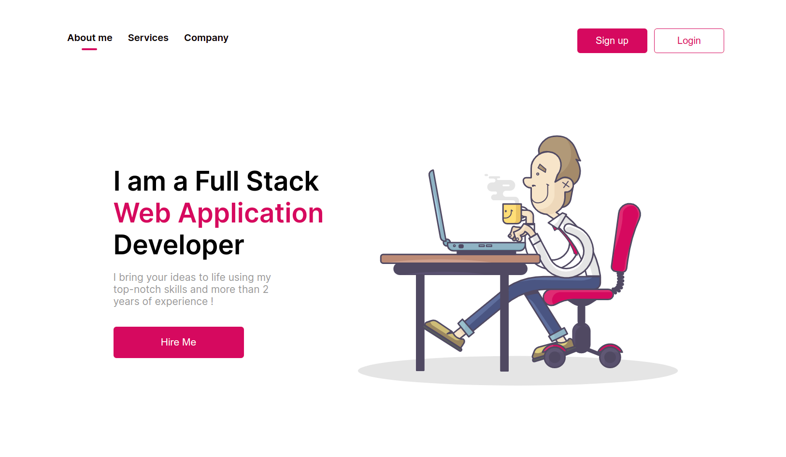

## Hello All, this is GitHub repository for all the files for youtube-projects section of my youtube videos.

### Please select your desired branch and you'll find the project related files there.

### Youtube Playlist: https://youtube.com/playlist?list=PL6nhfdAg020cT6Z0OLzmu-gfN7J3xKPKc (Become a Freelance Frontend Developer by Building Projects)

## Projects Till Now:

1. Project 01: Responsive Portfolio Page

- - Live : https://project-01-portfolio.netlify.app
- - Video : https://youtu.be/IqSAdqMqJK4

## Preview

2. Project 02: Portfolio Landing Page Clone

- - Live : https://foodpanda-css-clone.netlify.app/
- - Video : https://youtu.be/i5YXTOdTizY

## Preview

3. Project 03: YouTube Landing Page Clone (Under Development ...)

- - Live : https://youtube-clone-developer-junaid.netlify.app/
- - Video : ....
